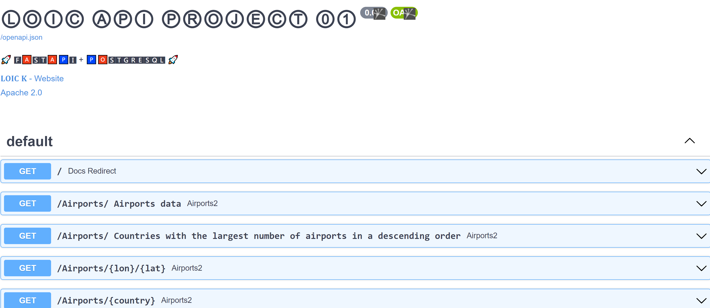
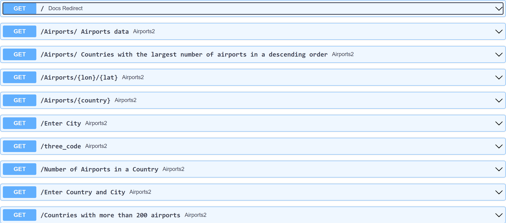
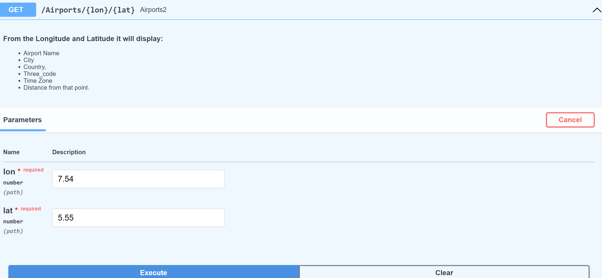
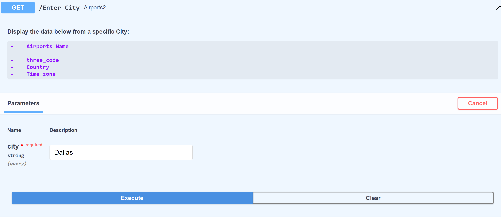
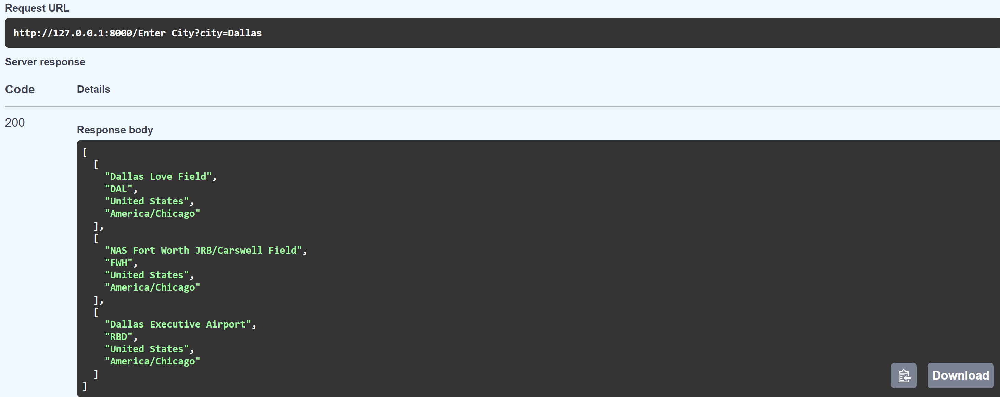
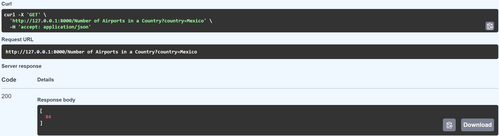

## Project 01 - Project setup with Postgres + Postgis + Fastapi + Docker

- []: # **Language:** _**markdown**_
- []: # **Path:** _**README.md**_
- []: # **Title:** _**Project 01**_
- []: # **Author:** _**[Loic_Konan](Loic_Konan)**_
- []: # **Date:** _**2022-09-08**_
- []: # **Description:** _**Project setup with Postgres + Postgis + Fastapi + Docker**_
- []: # **Tags:** _**[Postgres, Postgis, Fastapi, Docker]**_

## Loic Konan

### Description

- **Postgres + Postgis + Fastapi + Docker**.
- Using **Pgadmin4** for Visualization tools to help debug problems.
- Created a DB called **Project1** with a public schema.
- Created a **location** table with a geometry data type for **spatial query's** to be run.
- Created a local database using data files located at the following address: **<https://cs.msutexas.edu/~griffin/data/>** (Airports2).
- Created _**GET routes**_ to retrieve data from the database using the following route:
  
<br /> <br />

<h2 align="center"> **<http://127.0.0.1:8000/docs#/>** (Swagger) to see the documentation of the API. </h2>

  

<br /> <br /><br /><br /><br /><br />

### GET Routes
>
> - **Display all the 7 different Routes:** <http://127.0.0.1:8000/docs#/default/docs_redirect__get>
> 

<br /> <br /><br /><br /><br /><br />

> - **Route display all the AIRPORTS between this longitude and latitude:**
> <http://127.0.0.1:8000/docs#/default/airports2_Airports__lon___lat__get>
> 

<br /> <br /><br /><br /><br /><br />

> - **Route display all the AIRPORTS in a specific City:**
> <http://127.0.0.1:8000/docs#/default/airports2_Enter_City_get>
> 

<br /> <br /><br /><br /><br /><br />

> - **Route display Countries with more than 200 Airport.:**
> <http://127.0.0.1:8000/docs#/default/airports2_Countries_with_more_than_200_airports_get>
> 

<br /> <br /><br /><br /><br /><br />

> - **Route Route display all the AIRPORTS in a specific in Dallas:**
> <http://127.0.0.1:8000/Enter> City?city=Dallas>
> 

<br /> <br /><br /><br /><br /><br />

> - **Route display the total number of Airports in Mexico:**
> <http://127.0.0.1:8000/NumberofAirportsinaCountry?country=Mexico>
>
> 
>
### Instructions

- Must have **Python** installed on your computer.
- Must have **Fastapi** installed on your computer.
- Must have **Postgres** installed on your computer.
- Must have **Postgis** installed on your computer.
- Must have **Psycopg2** installed on your computer.

- run the following **command** to start the server:
  
  - Click on the **play button** in the top right corner of the screen.
  - Or **uvicorn api:app --reload**
  
- Run the following command to start the **docker container** (Only if you have Docker install) :
  
  ```bash
  docker-compose up -d
  ```

- Interact with the **API** using the following routes:
  
  - **<http://127.0.0.1:8000/docs#/default/docs_redirect__get>** (Swagger)
  - Click on the **GET** button to see the results.
  - Click on the **Try it out** button to see the results.
  - Click on the **Execute** button to see the results.
  - Click on the **Clear** button to clear.
  - Click on the **Cancel** button to cancel the process.
  
### Files

|   #   | File                               | Description                                     | Status                  |
| :---: | ---------------------------------- | ----------------------------------------------- | ----------------------- |
|   1   | [api.py](api.py)| api file file    | :ballot_box_with_check: |
|   2   | [README.md](README.md) | README file | :ballot_box_with_check: |
|   3   | [docker-compose.yml](docker-compose.yml) | docker-compose file | :ballot_box_with_check: |
|   4   | [airports2.csv](airports2.csv) | airports2 file | :ballot_box_with_check: |
