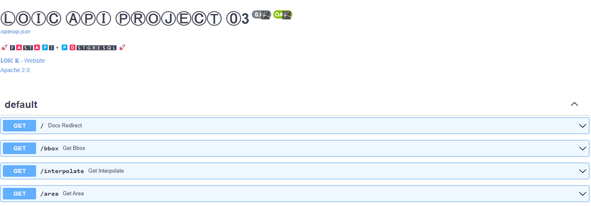
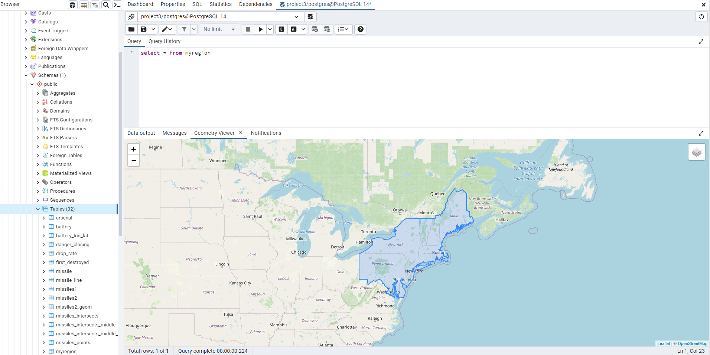
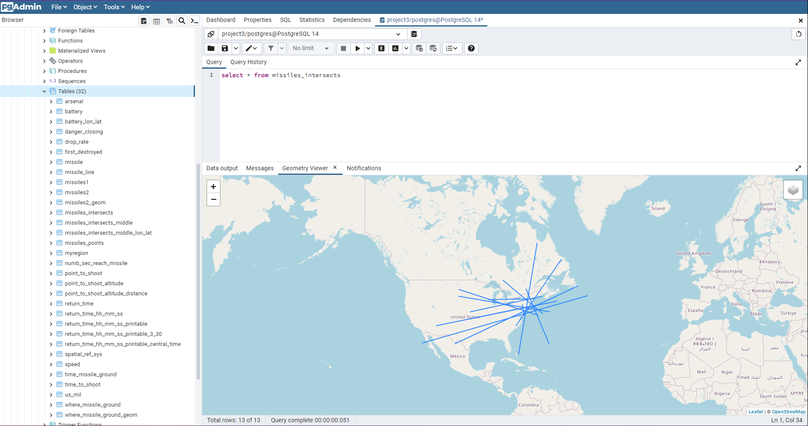

## Project 03  Missile Command (Part 1)

### Loic Konan

#### Description

- Missile Command was an 80's arcade game in which the player had to defend earth using anti-missile batteries that shot defensive "clouds" into the air (see animation).
- We will create our own "no graphics" implementation of the game incorporating our spatial db concepts.
- This first part of the game is to determine our Region and to generate a series of missile paths which intersect with a our region.
- 

#### Data

1. [US_Military_Base](US_Military_Bases) - This is a list of military bases in the US. But below is our **Region**

  
2. Random Missile Paths

### Files

|   #   | File                 | Description                                     |
| :---: | -------------------- | ----------------------------------------------- |
|   1   | [main.py](main.py)   | The main file with comments and description     |
|   2   | [main.sql](main.sql) | The main sql file with comments and description |

### References

|   #   | File                                                                                   | Description |
| :---: | -------------------------------------------------------------------------------------- | ----------- |
|   1   | [https://postgis.net/docs/ST_Buffer.html](https://postgis.net/docs/ST_Buffer.html)     | ST_Buffer   |
|   2   | [https://postgis.net/docs/ST_Distance.html](https://postgis.net/docs/ST_Distance.html) | ST_Distance |
|  16   | [https://postgis.net/docs/ST_Area.html](https://postgis.net/docs/ST_Area.html)         | ST_Area     |

### References Description

- **ST_Buffer** - Returns a geometry that represents all points whose distance from this Geometry is less than or equal to distance.
- **ST_Distance** - Returns the 2-dimensional cartesian minimum distance (based on spatial ref) between two geometries in projected units.
- **ST_Area** - Returns the area of the surface if it is a polygon or multi-polygon.

### Instructions

- This program does not require any non standard libraries

### Example Command

- None for now.
